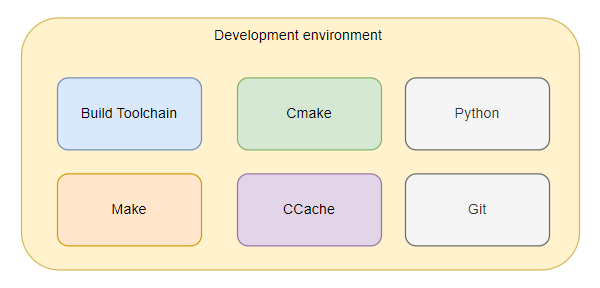
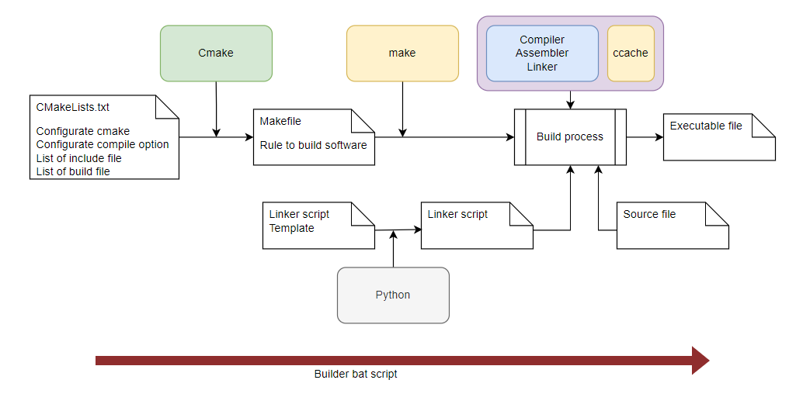

= SOLUTION DOCUMENT - SETUP DEVELOPMENT ENVIRONMENT
Tran Hoang Nguyen 
1.0, Nov 29, 2023
:toc:
:icons: font
:url-quickref: https://docs.asciidoctor.org/asciidoc/latest/syntax-quick-reference/

Content entered directly below the header but before the first section heading is called the preamble.

== 1. Overview or Introduction

Development environment is reponsible for:
    Tool to implement Sw
    Setup build environment
    Perform build SW
    Additional tool for increase performance
Development environment store:
    Toolchain for building
    Tool for pre-build
    Tool to increase performance

== 2. Summary of Existing Functionality (Context)

Development environment of project need more than building SW, it can composite with other tool to gen code, compile code with external library when nessessary.

Development environment need fexible, can easy to add more tool into development SW phase.

== 3. Requirement detail

Development environment can easy add external tool

== 4. Assumptions and Prerequisites

* OS Environment: only support Window OS

* Tool verion: To make sure Compatible version. Development environment is packed into package. Avoid overwrite tool in package by other version.

== 5. High-Level Design

=== 5.1 Static view

* Development environment package include:
**    Compile toolchain: compiler, linker, assembler
**    Cmake
**    Make
**    CCache
**    Python
**    Git

.Static view

=== 5.2 Dynamic view

//image
.Dynamic view

|===
| Tool |Description

|Compile tool
| Provide tool to compile, link source to excutable file

|Cmake
| Generate Makefile, manage source file

|Make
| Generate rule to compile individual source file

|CCache
| Increase building software speech

|Python
| Generate linker script from multiple file input

|Git
|Control repository

|===

=== 5.3 Install environment

Depend on instruction of each tool

=== 5.4 Build software

Run bat script in project folder to start build software

== 6. Low-Level Design

=== 6.1 Builder folder

* Builder folder contain:

** Bat file to start build process +
** CCache configuration +
** Python program to generate linker script +

=== 6.2 CMake configuration

Each subfolder will contain CMakeList file to control build source.

=== 6.3 Build folder

Build folder is output folder of build process +
Build folder contain excutable file, map file, final linker script

== 7. Impact Analysis 

== 8. Out-of-scope

== 9. Risks and Mitigation

== 10. Appendices

|===
|Term |Definition

|
|

|===

== 11. Reference

|===
| Term | Link

|
|
|===

