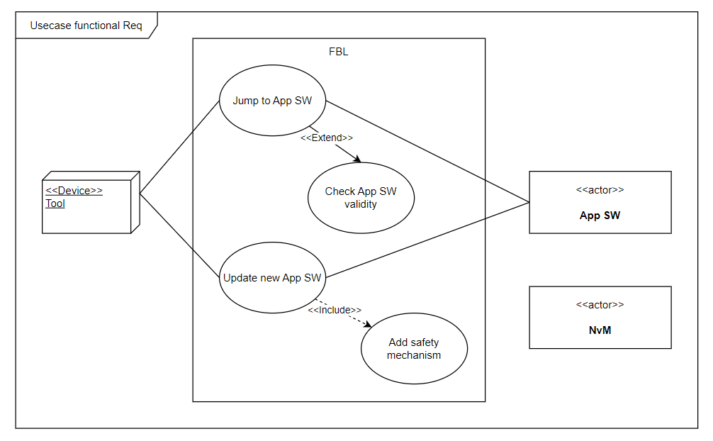

= FLASH BOOTLOADER SOFTWARE DOCUMENT
Tran Hoang Nguyen <hoangnguyen220999@gmail.com>
1.0, Nov 29, 2023
:toc:
:icons: font
:url-quickref: https://docs.asciidoctor.org/asciidoc/latest/syntax-quick-reference/

Content entered directly below the header but before the first section heading is called the preamble.

== 1. Introduction and goal

This is a paragraph about role of *Flash bootloader software*.

.Image
[I am the image alt text.]

=== 1.1 Requirements overview

Flash bootloader is a software in flash. It allows to reflash application software over CAN communication. 
Tool can be used to send request and receive respond from ECU.

.Main features:
** It is the first software when MCU power-on
** It is responsible for FBL service check validation and respond
** It control checking and jumping to application software

.The following goals have been established for this system:
[cols="^3,20"]
|===
|Priority |Explicite functional Requirement

|1
|FBL SW shall support reflashing service via Tool

|1
|FBL SW shall support checking validity of application software before decision whether jump to app or not

|2
|FBL SW shall have size less than 10K (*)

|2
|FBL SW shall support checking validity of receiving message in specical case (**)

|1
|FBL SW shall fit with MCU without Non-volotile memory

|=== 

(*) Accepted Maximum size is 14K

(**) specical case: receive new application SW

.Image
[I am the image alt text.]

=== 1.2 Quality goals

.Table title
|===
|Quality attribute |Description |Quality scenarios

|Performance - Resource utilization
|SW has size less than 10K
|SC1

|Reliability - Availability
|
|CS2

|Portability - Adaptability
|SW shall be easy to adapt between HW with Nvm and without Nvm
|CS3
|===

_CS1_ +

.Performance scenario

_CS2_ +

.Reliability scenario

_CS3_ +

.Portability scenario

== 2. Contraints

* Only support STM32F103C8T6 Hardware

*	Porting hardware. Hardware must satisfy:
**	RAM minimunsize: 20K
** ROM minimunsize: 4K
** Support CAN standard hardware
** Integration MCAL and Application. Required MCAL:
*** STD Driver library

== 3. Context and Scope

=== 3.1 Business context

Business context descript data exchanged with the environment of the system.

.Business context

=== 3.2 Technical context

Technical context descript technical interfaces (channels and transmission media) between the system and its context.

.Technical context

== 4. Solution strategy

|===
//| Quality goal |Scenario |Solution approach |Link to Details
|Scenario |Solution approach |Link to Details

//| 
| Development environment
| Setup package include all tool and use bat script to build sw
| link:DDD/DDD-Setup_Development_environment.adoc[DDD-Development environment] + 
link:DDD\SDD-Setup_Development_environment.adoc[SDD-Development environment]

//|
| Communication between modules in software
| Use global variable to share data between modules with safety machanism
| link:DDD/DDD-Communication_between_modules.adoc[DDD-Communication between modules] +
link:DDD/SD-Communication_between_modules.adoc[SDD-Communication between modules]
 
//|
//|
//|
//| link:DDD/DDD-Communication_mechanism_with_external_system[DDD-Communication mechanism with external system]

//|
| Communication protocol with external tool
| Provide messsage format and sequence of request
|link:IDD\IDD_FBL_Communication_Protocol.adoc[IDD-Tool communication protocol]

//|
| Software safety flashing machanism
| Flash driver will be stored in tool and update to FBL when request
|link:DDD\DDD-Software_interlock.adoc[DDD-software interlock] +
link:DDD\SD_Software-interlock.adoc[SDD-software interlock]

|===

== 5. Building block view

=== 5.1 Building Block View Level 1
//image
.Building Block View Level 1

|===

| |

|Main module
|Setup hardware configuration, run main state machine

|MCAL module
|Provide driver API for hardware configuration

|Service handler module
|Check validity of request, call servide

|SWIL handler module
|Handle write SWIL to RAM

|Flashing handler module
|handle erase application software and flash new application

|Diag communication module
|Provide API for diag communication

|Nvm handler
|Provide API to read/write data in Nvm

|===

=== 5.2 Building Block View Level 2
//image
==== 5.2.1 Main module

//image
.Main module

==== 5.2.2 MCAL module

//image
.MCAL module

==== 5.2.3 Service handler module

//image
.Service module

==== 5.2.4 SWIL handler module

//image
.SWIL module

==== 5.2.5 Flashing handler module

//image
.Flash module

==== 5.2.6 Diag communication module

//image
.Flash module

==== 5.2.7 Nvm handler module

//image
.Nvm module

//==============================

== 6. Runtime view

=== 6.1 Main 
==== 6.1.1 Main statechart diagram

//image
.Main statechart

==== 6.1.2 Main sequence diagram

==== 6.1.3 Main activity diagram

=== 6.2 Handling SWIL

==== 6.2.1 Handling SWIL statechart diagram

//image
.Handling SWIL statechart

==== 6.2.2 Handling SWIL sequence diagram

//image
.Handling SWIL sequence

//image
.Loop sequence

==== 6.2.3 Handling SWIL activity diagram

//image

.SWIL handle sequence

=== 6.3 Erase handle
==== 6.3.2 Erase handle statechart diagram

//image
.Erase handle statechart

==== 6.3.2 Erase handle sequence diagram

//image
.Erase handle sequence

==== 6.3.3 Erase handle activity diagram

//image
.Erase handle sequence

=== 6.4 Flash handle
==== 6.4.1 Flash handle statechart diagram

//image
.Flash handle statechart

==== 6.4.2 Flash handle sequence diagram

//image
.Flash handle sequence

//image
.Loop sequence

==== 6.4.3 Flash handle activity diagram

//image
image::6_runtime/ad_flash1.png[align="center"]

.Flash handle sequence
image::6_runtime/ad_flash3.png[align="center"]

== 7. Deployment view
=== 7.1 Static view
//memory hardware layout
//can hardware
//image
.Static view

=== 7.2 Dynamic view

//image
.Dynamic view

== 8. Crosscutting concepts

=== 8.1 Diag message

* Motivation: + 
** Each service need to communication with Tool to send and receive status in service process +
** These message need follow one specific format (diagnostic communicaition)

* Solution: +
** Diag com module will define standard format for message before send/receive to CAN driver +
** Diag com will be included into all service module to perform transmit formal data

=== 8.2 Nvm interaction

* Motivation: + 
** Some service need to check/write Nvm data to perform next step +

* Solution: +
** Nvm handler module will provide API for other module to read and write data. Other module will not access to NVM driver directly. Handling Nvm driver will be handle by Nvm handler +
** Nvm handler will be included into all service module to perform process Nvm data

== 9. Architecture decisions

|===
| Architecture decisions | Link

| Software structure design
| link:ADR/ADR-Software_structrure.adoc[ADR Software structrure]
|===
//ADR -Architecture Decision Record

== 10. Quality requirements

//This section contains all quality requirements as quality tree with scenarios. The most important ones have already been described in section 1.2. (quality goals)
//Here you can also capture quality requirements with lesser priority, which will not create high risks when they are not fully achieved.

=== 10.1 Quality Requirements

=== 10.2 Quality Scenarios

== 11. Risks and Technical Debt

//Hardware without Nvm => can not check validation of app sw each ig cycle

|===
| Risk |Desdription |Priority |Impact

| Hardware without Nvm
| SW can not store validity of APP SW
| 1
| FBL can accept/auto jump to APP althougth APP SW invalid

| 
|
|
|

|===

== 12. Glossary

|===
|Term |Definition

|DDD
|Design decision document

|SDD
|Solution design document

|SWIL
|Software interlock

|CAN
|controller area network

|Nvm
|Non-volotile memory

|===

== 13. Appendix

This is a link to the https://docs.asciidoctor.org/home/[Asciidoctor Documentation]. +
Arc42 template reference https://arc42.org[Arc42 Documentation].

== Contact information
Email (our adress is spam-protected)
LinkedIn
Github issue tracker

